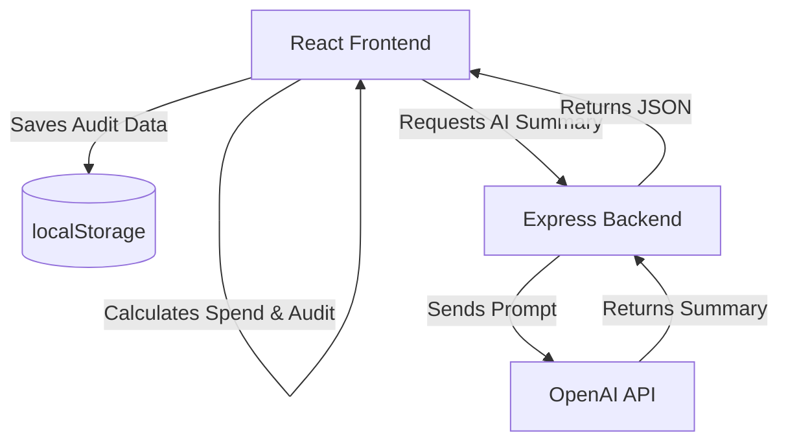

# System Architecture

## System Diagram

## Frontend/Backend Data Flow
1. **User Input:** The user inputs their team size, use case, and selected tools on the React frontend.
2. **Local Processing:** The React app instantly calculates the total spend and runs the `auditEngine` locally to generate recommendations.
3. **AI Request:** The frontend makes a `POST` request to `/api/summary` on the Express backend, passing the calculated savings and tool list.
4. **Backend Processing:** The Express server constructs a prompt and securely calls the OpenAI API.
5. **Response:** The backend returns the AI-generated summary back to the frontend to be displayed.

## localStorage Persistence
To keep the application fast and avoid the overhead of a database for this version, we use `localStorage`:
- **Form State:** `spend_teamSize`, `spend_useCase`, and `spend_tools` are continuously saved so users don't lose their input if they refresh.
- **Shareable Links:** When an audit is run, a unique ID is generated. The entire audit payload is saved under `shared_audit_${id}`. When someone visits `/audit/:id`, the app retrieves this payload and reconstructs the results page.

## Audit Engine Logic
The engine is a pure JavaScript function that takes the array of user tools and compares them against predefined rules:
- **Rule 1 (Oversized Plans):** If a user is on an "Enterprise" plan but has a small team (e.g., < 10 seats), it recommends downgrading to a "Pro" plan.
- **Rule 2 (Redundancy):** If a user pays for multiple similar tools (e.g., ChatGPT Plus and Claude Pro), it suggests consolidating to one.
- **Calculation:** It calculates the price difference and returns an array of actionable recommendations with estimated monthly savings.

## Why React + Express?
- **React:** The dynamic nature of the form (adding/removing tools, auto-updating costs) required a component-driven framework with strong state management. React makes UI updates instantaneous.
- **Express:** We needed a backend primarily to hide the `OPENAI_API_KEY`. Calling OpenAI directly from React is a major security risk. Express is lightweight and incredibly easy to set up for this single purpose.

## Scaling Considerations (For 10k audits/day)
If this tool goes viral and hits 10,000 audits per day, our current architecture would need upgrades:
1. **Database Integration:** `localStorage` won't work for real sharing. We'd need to migrate the shared audits to a NoSQL database like MongoDB or PostgreSQL.
2. **Caching:** We would implement Redis on the backend. If two users have the exact same tool stack, we could serve a cached AI summary instead of paying OpenAI again.
3. **Rate Limiting:** We'd need to add `express-rate-limit` to the backend to prevent malicious users from spamming the `/api/summary` endpoint and draining our OpenAI credits.
